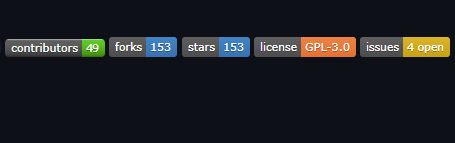

# ReadME

## Table of Contents

1. [Description](#description)
2. [What is readme](#what-is-readmemd)
3. [Markdown syntax](#markdown-syntax)
4. [Sections and information](#sections-and-information)
5. [Credits](#credits)
6. [License](#license)

### Description

This project `ReadME` file about how to create a `README.md` file, it explains what is it? why it is important? what information should go into it? and how to form and convey this information in sections using markdown language syntax in a simple way.

---

### What is README.md ?

It is a text file made using [markdown](https://www.markdownguide.org/basic-syntax/) language. this file work as a manual of an application. It provides information to help the project's audience understand, use, and collaborate on the project. anyone working on it can make this file, it is supposed to be the first file to create and place in the top-level directory of the project.

---

### Markdown syntax

The markdown language syntax is very simple and you can do the same thing in several ways but for simplicity, we will choose just one way to help you get started. below is an unordered list. each item is a syntax to add an element followed by an implemented example.

- Unordered list starts with any of these options **`+, -, *`** example with minus '`- `'
  - list item 1
  - list item 2
- ordered list starts with '`1. `'
  1. list item 1
  2. list item 2
- Add header '`# H1`' one for biger header h1 and '`###### H6`' for smaller one h6
  # H1 example
  ###### H6 example
- `*Italic text surrounded by 2 asterisks*` example _Italic text surrounded by two asterisks_

- `**Bold text surrounded by 4 asterisks**` example **Bold text surrounded by 4 asterisks**

- Add quotation '`> Blockquote`'

  > This is a blockquote it should be very long text spanning multiple lines.

- Add Horizontal line '`***`'

- Add code between 6 backticks ` '```Code Here```' `

```
// To install dependencies run this command.

npm install
```

- Add link `[google](https://www.google.com)`

  1. [google](https://www.google.com)

- Add image `[alt text](image url "hover title")`.

  

---

### Sections and information

When come the time to write a README file for your project you need two things: know markdown language syntax, and project information, then you have to organize this information in sections for easier navigation and usage. you can name your sections anything you like but there are some sections' names that are a convention among developers.
Although, no identical projects there is a lot of information in common that you can pick and provide to the audience. you can use this list of sections and what information it holds to get started.

- project title

  - It is the `Project's name`. it should be at the top of README.md like `README` on the top of this file.

- description

  - What project can do?
  - List of features
  - Technologies used

- Installation

  - `Requirements` can be a markdown list or a separate file called '`REQUIREMENTS.md`'
  - step by step `instructions` to get up and running using markdown code syntax

- Usage

  - `Examples` of how to use it? using markdown code syntax
  - `Screenshots` using markdown image syntax

- Contribute

  - Requirements and Instructions on how to contribute use any appropriate form of markdown syntax or split it into a separate file with the name `CONTRIBUTING.md`

- Support

  - Provide links to resources, tutorials, wiki, email, and other documentation to help people facing problems with the app. use appropriate form of markdown

- Credits

  - Include Author, contributors, and team members with links to their GitHub and social media.

- Badges

  - It is small images can you generate with [shields](https://shields.io/)
  - You can use to indicate count of `issues`, `Stars`, `contributors`, `version`
  - Indicate `passing tests`, `Style`
  - and more...
  - 

- License

  - For open source project you should add License so users know what can do with your application exactily. to pick the right license go to [Choose a license](https://choosealicense.com/)

---

### Author

Saber Kassem Ali
[GitHub](https://github.com/ablazeArrow), [LinkedIn](https://www.linkedin.com/in/ablaze-arrow/)

---

### License

[MIT](https://choosealicense.com/licenses/mit/)

---

[UP](#table-of-contents)
